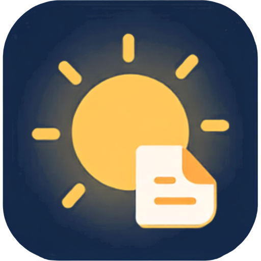
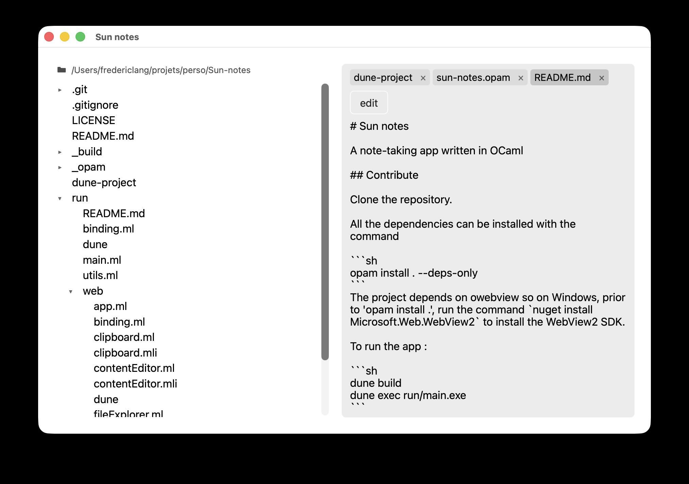

<p align="center">
  
</p>
<h1 align=center>Sun notes</h1>
<p align="center">A note-taking app written in OCaml</p>
<br/>

Implemented with the libraries Owebview for the desktop-GUI bindings and Vdom for the web rendering.



## Download

Click on the "Releases" link of the Github page of the repository to access the installers.

For now only MacOS with arm64 architecture (M-series) is provided.

## Contribute

Clone the repository.

All the dependencies can be installed with the command

```sh
opam install . --deps-only
```
The project depends on owebview so on Windows, prior to 'opam install .', run the command `nuget install Microsoft.Web.WebView2` to install the WebView2 SDK.

To run the app :

```sh
dune build
dune exec run/main.exe
```

## License

MIT